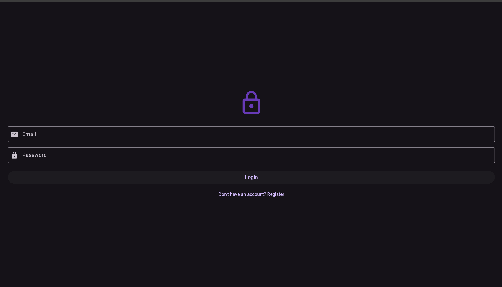
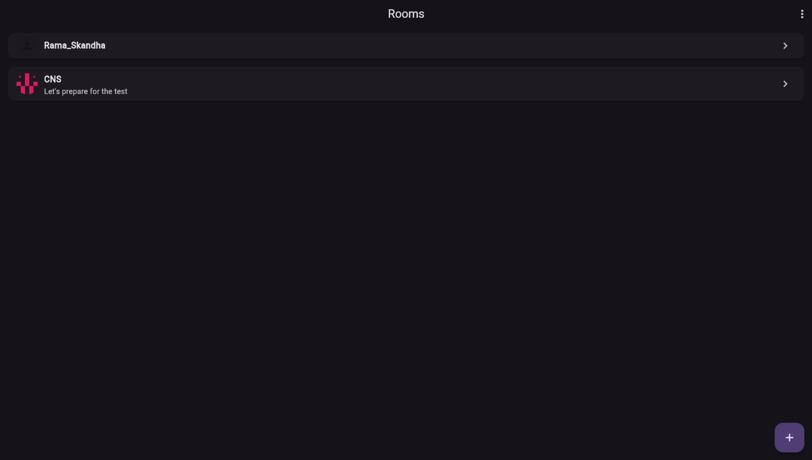
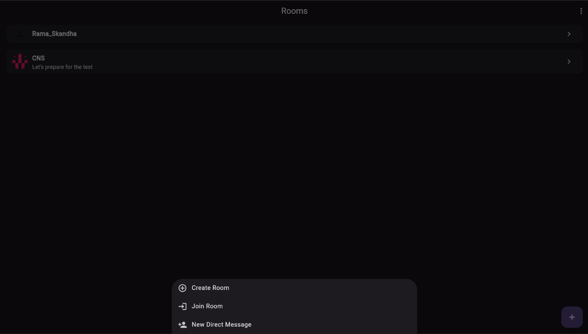
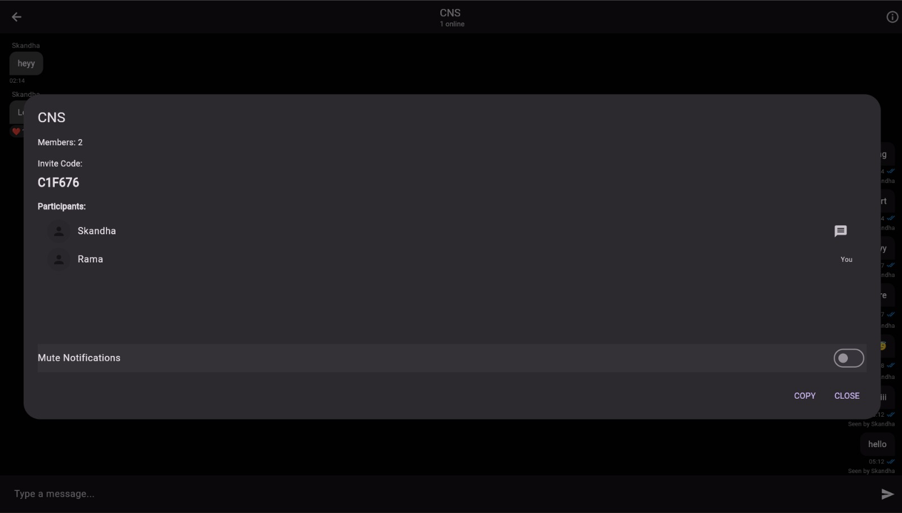
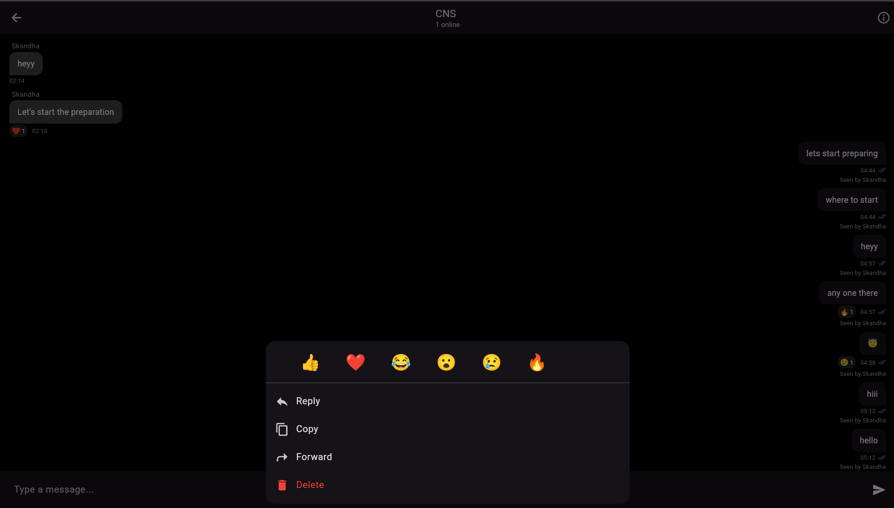
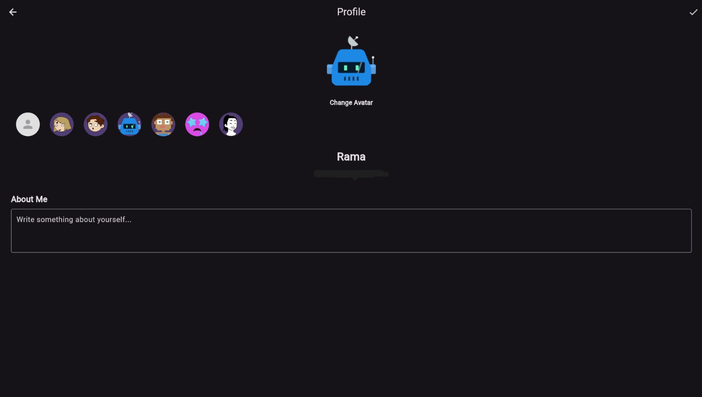

# Real-Time Chat Application

Cross-platform real-time chat app with group messaging, direct messages, read receipts, and emoji reactions.

**Live Demo**: [https://your-netlify-url.netlify.app](https://your-netlify-url.netlify.app)  
**Backend**: [https://your-railway-url.up.railway.app](https://your-railway-url.up.railway.app)  
**GitHub**: [https://github.com/PR-Skandha-B/Live_Chatapp.git](https://github.com/YOUR-USERNAME/chat-app)

---

## Screenshots

### Login & Authentication

### App Home Screen 

### Options

### Rooms List & Home Screen

### Chat with Reactions & Read Receipts

### User Profile Edit

---

## Tech Stack

### Backend
- **Runtime**: Node.js
- **Framework**: Express.js
- **Real-time**: Socket.io (WebSocket)
- **Database**: MongoDB
- **Auth**: JWT
- **Deployment**: Railway

### Frontend
- **Framework**: Flutter (Dart)
- **State Management**: Provider
- **Storage**: Hive (local)
- **UI**: Material 3
- **Deployment**: Netlify (Web build)

---

## Features

✅ **Real-time Messaging**
- WebSocket-based communication via Socket.io
- Persistent connections for instant message delivery
- Room isolation (group chats & DMs)

✅ **Read Receipts**
- Per-user tracking of who has seen messages
- Visual indicators (single ✓ = sent, double ✓✓ = seen)
- Blue double-tick on sent messages

✅ **Emoji Reactions**
- React to messages with 100+ emojis
- Toggle emoji on/off
- Exchange emojis (switch from one to another)
- Real-time reaction updates

✅ **Message Threading**
- Swipe-to-reply on messages
- Quoted message previews
- Threaded conversation view

✅ **Direct Messaging**
- One-on-one private conversations
- Auto-create DM rooms on first message
- Per-user message visibility (soft delete)

✅ **Typing Indicators**
- See when others are typing
- Real-time status updates
- Auto-clear after 3 seconds

✅ **Room Management**
- Create group chat rooms
- Join via invite code
- Edit room name/description (admin only)
- View room members

✅ **Message Features**
- Delete messages (sender only)
- Forward to other rooms
- Message history (last 50 messages)
- Timestamp on each message

✅ **Authentication**
- JWT-based user authentication
- Secure password hashing (bcrypt)
- Login & registration
- Token persistence (local storage / Hive)

---

## Architecture
Frontend (Flutter)                Backend (Node.js)              Database
↓                                  ↓                            ↓
[Login Screen] ──HTTP──→ [Auth Routes]                          [MongoDB]
[Rooms List]  ──HTTP──→ [Room Routes]   ↔️  [Models]               │
[Chat Screen] ←→ WebSocket ↔️ [Socket Handlers]                   │
↓                      ↑                                        │
[Local State]           [Real-time Events]  ←────────→ [Message Storage]
(Provider)             (Socket.io)                     [User Profiles]
[Room Config]